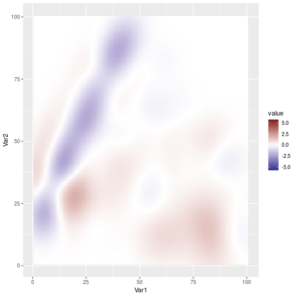

```
## Loading required package: permute
```

```
## Loading required package: lattice
```

```
## This is vegan 2.5-6
```

```
## Loading required package: phyloseq
```

```
## Loading required package: ggplot2
```

```
## 
## microbiome R package (microbiome.github.com)
##     
## 
## 
##  Copyright (C) 2011-2018 Leo Lahti et al. <microbiome.github.io>
```

```
## 
## Attaching package: 'microbiome'
```

```
## The following object is masked from 'package:base':
## 
##     transform
```


