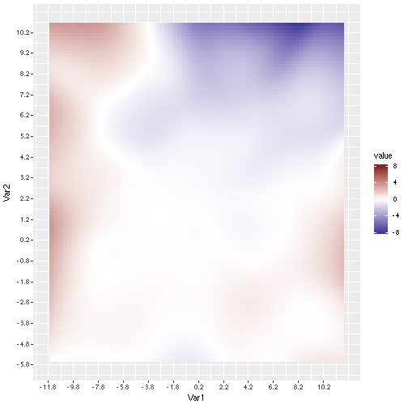

```r
# Example data
library(microbiome)
library(reshape2)
library(scales)
data(atlas1006)
ps <- transform(atlas1006, "clr")

# Two sample groups to compare
gh <- sample_names(subset_samples(ps, gender == "male"))
gc <- sample_names(subset_samples(ps, gender == "female")) 

# PCA
proj <- princomp(t(abundances(ps)))$scores[, 1:2]

# Density estimates
library(MASS)
ddd <- proj[gh,]
x <- ddd[,1]
y <- ddd[,2]
zh <- kde2d(x, y, n = 100, lims = c(range(proj[,1]), range(proj[,2])))

ddd <- proj[gc,]
x <- ddd[,1]
y <- ddd[,2]
zc <- kde2d(x, y, n = 100, lims = c(range(proj[,1]), range(proj[,2])))

# Difference in densities
# (also possible to consider other measures, I am not sure if this is optimal or justifies 
# but it gives a nice plot)
dif <- log(zc$z) - log(zh$z)

# Arrange
dfm <- melt(dif)
colnames(dfm) <- gsub("^X", "Var", colnames(dfm))  

# X axis ticks and labels
s <- round(seq(round(min(proj[,1]), 1), round(max(proj[,1]), 1), 2), 1)#[1:7]
sx <- 100 * ((s - min(proj[,1]))/diff(range(proj[,1])))

# Y axis ticks and labels
t <- round(seq(round(min(proj[,2]), 1), round(max(proj[,2]), 1), 1), 1)
tx <- 100 * ((t - min(proj[,2]))/diff(range(proj[,2])))

p <- ggplot(data = dfm, aes(x=Var1, y=Var2, fill=value)) +
         geom_tile() +
         scale_fill_gradient2(low = scales::muted("blue"),
                              mid = "white",
			      high = scales::muted("red"), midpoint = 0,
	   limits = c(-8, 8)) + # the color scale limits must be tuned for data (automate if possible)
	 scale_x_continuous(breaks = sx, labels = s, limits = c(0, 100)) +
	 scale_y_continuous(breaks = tx, labels = t, limits = c(0, 100)) 	 

print(p)
```


